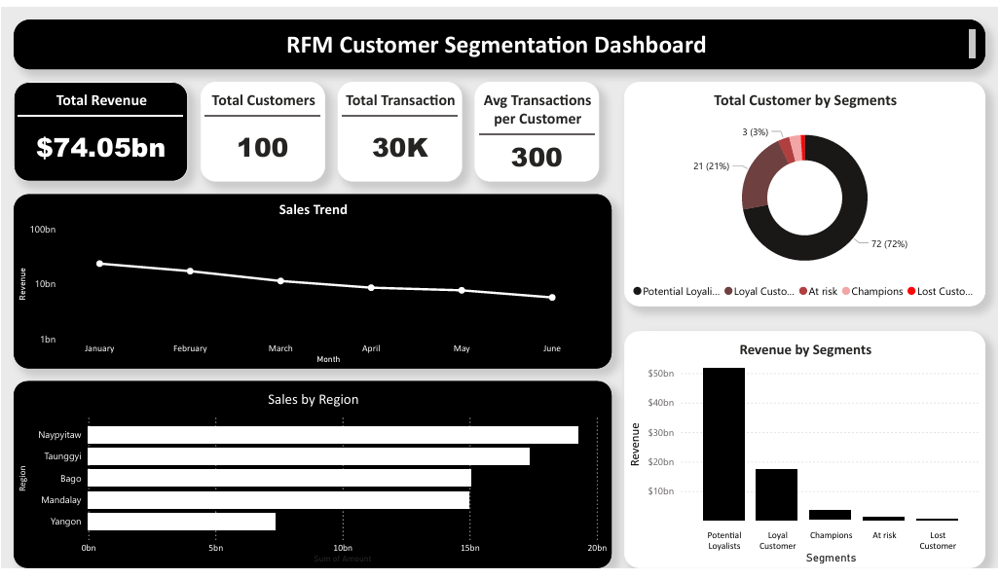
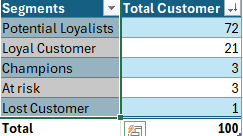

# Customer-Segmentation-with-RFM-Recency-Frequency-Monetary
This project divides the customers to different segments with RFM (Recency, Frequency, Monetary). The segmentation is for understanding the customers behavior and finding the high value and low value customers.

## Company background

Linkon is an online shop selling furniture, office supplies, and electronis. The company has been active since 2019.

The dataset used in this project contains information on Transaction ID, Customer ID, Date, Region,	Product ID,	Product Name,	Product Category,	Quantity,	PPU, and Amount. This project aims to identify valuable cuastomers and improve marketing strategy.

Insights and recommendations are provided in the following areas:

1. **Customer Segments** - Dividing the customer into 5 categories : Loyal customer, Potential Customer, At risk, Champions, and Lost Customer.
2. **Revenue by Segments** - Identifying which customer segements contribute the most to total revenue
3. **Sales Trend** - Analyzing the revenue in 2025 from January - june
4. **Sales by Region** - Analyzing sales performance by region to identify top contributing market

## Files

**The Excel Analysis File** [View File](Files/RFM_sales.csv)

**Raw Files** [View File](Files/raw_rfm_sales_transactions_30000.csv)

## Tools

1. **Microsoft Excel**
2. **Power BI**

---

## Executive Summary
## RFM Customer Segmentation Dashboard

## Overview of fimdimgs

**Customer Segments**

The largest customer segments are potential loyalist customers with total 72 customers. Many customers have potential to be loyal customers.with right marketing strategy, such as personalized promotions the business can convert them to loyal customer.

---

## Key Insights

## 1. Customers Segments

- With total 100 customers, there are 72 total potential loayalist customers. Many customers have potential to be loysl customers.with right marketing strategy, such as personalized promotions the business can convert them to loyal customer.
- 

