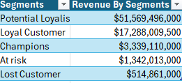
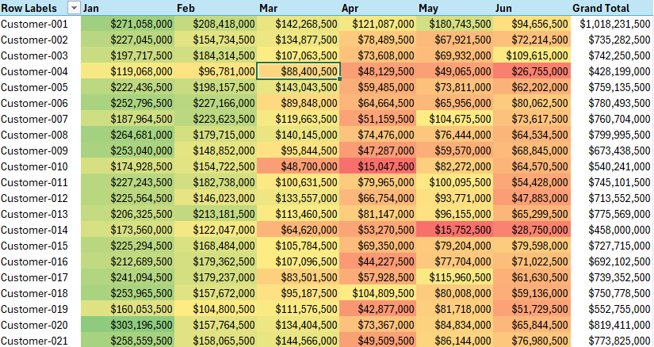

# Customer-Segmentation-with-RFM-Recency-Frequency-Monetary
This project divides the customers to different segments with RFM (Recency, Frequency, Monetary). The segmentation is for understanding the customers behavior and finding the high value and low value customers.

## Company background

Linkon is an online shop selling furniture, office supplies, and electronis. The company has been active since 2019.

The dataset used in this project contains information on Transaction ID, Customer ID, Date, Region,	Product ID,	Product Name,	Product Category,	Quantity,	PPU, and Amount. This project aims to identify valuable cuastomers and improve marketing strategy.

Insights and recommendations are provided in the following areas:

1. **Customer Segments** - Dividing the customer into 5 categories : Loyal customer, Potential Customer, At risk, Champions, and Lost Customer.
2. **Revenue by Segments** - Identifying which customer segements contribute the most to total revenue
3. **Sales Trend** - Analyzing the revenue in 2025 from January - june
4. **Sales by Region** - Analyzing sales performance by region to identify top contributing market

## Files

**The Excel Analysis File** [View File](Files/RFM_sales.csv)

**Raw Files** [View File](Files/raw_rfm_sales_transactions_30000.csv)

## Tools

1. **Microsoft Excel**
2. **Power BI**

---

## Executive Summary
## RFM Customer Segmentation Dashboard

## Overview of fimdimgs

**Customer Segments**

The business generated a total revenue of $74.05B from 30K transactions made by 100 customers. On average, each customer made 300 transactions, indicating that customers tend to purchase repeatedly and contribute significantly to overall revenue.

---

## Key Insights

## 1. Customers Segments

- With total 100 customers, there are 72 total potential loayalist customers. Many customers have potential to be loysl customers with right marketing strategy, such as personalized promotions the business can convert them to loyal customer.
- There are 21 customers in Loyal Customers segment. The loyal customer already regurly purchased and engaged with the brand. The bussiness should the maintain strong relationship with customers with giving loyalty rewards or early access promotions.
- There are 3 customers in Champion segment. Champion customers are the valuest customers because they are recently,frequently, and spend a lot. These customers are the key for the revenue, should receive special attention and  retention strategies.
There are 3 customers in At Risk segment. At risk customers were previously active but have not purchased recently. Targeted campaigns or special offers could help re engage these customers before they stop purchasing completely.
- There are 1 customers in At Lost segment. Lost customers have not purchased for a long time. The business may attempt win-back campaigns, but the priority should be retaining active customers.

## 2. Revenue Segments

- The largest contributor for reveneu is potential loyalist with $51,5B, followed by loyal customer contributed for $17,2B.
- Although Champion is typically the most valuable customers in RFM analysis. This dataset show Potential loyalist is the major contributor for revenue, suggesting they are highly valuable customer and should be nurtured to loyal customer

## 3. Sales Trend

- The revenue trend is declining. The sales trend consistently decreases each month. January recorded the highest revenue around $23.5B while by June the revenue dropped to $5.7B.
- This downward trend may indicate decreasing customer engagement, seasonal affect, or reduced purchased activity.The company needs strategy to stimulates sales and maintain customer activity.

## 4. Sales by region

![Region](

- The region with the highest revenue is Naypyitaw around $19.2B and the lowest is Yangon around $7.3B
- The Yangon region need regional marketing improvement

## Recommendation

- Since revenue keeps declining each month which could indicate poor engagement, the change of seasonal demand, or ineffective marketing strategies. The company needs to re-engage customers. The possible action that company could try such as limited time promotions, seasonal campaigns,email, or targeted marketing cmapaingns.
- Since Potential Loyalists represent the majority of customers and revenue contributors, targeted engagement strategies should be implemented.
- Streghten customer retention strategis. The company could offer the customers VIP rewards program, prsonalized recommendations, dan customer appreciation campaings
- Improving sales in underperforming regions wihh regional marketing campaings, local promotions, partnerships with regional distributor.

